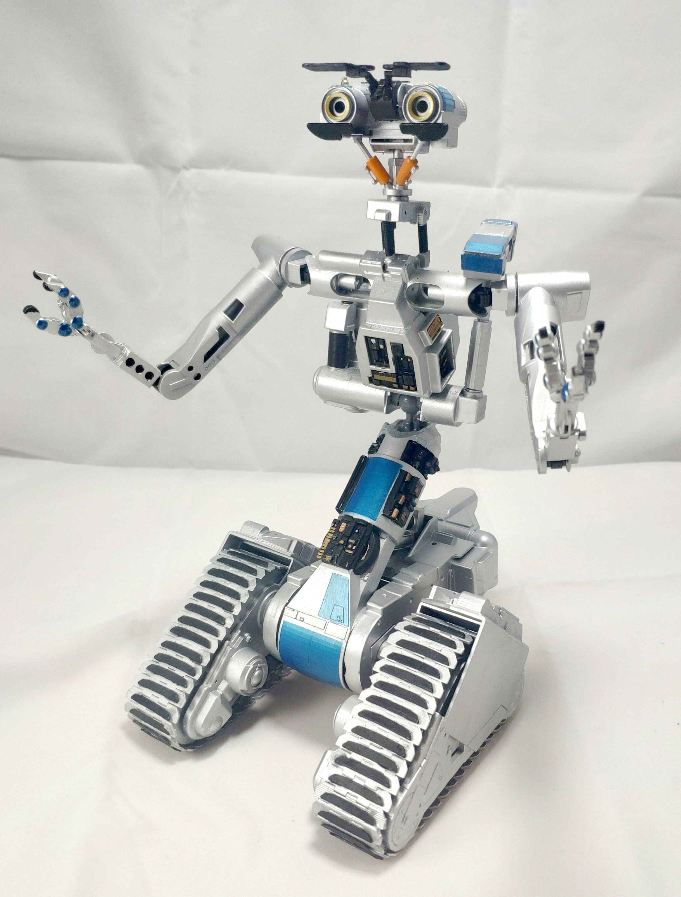

# openJohnny

The goal of this project  is to create an accurate set of models for printing a mini Johnny 5 from the short circuit movies.  Currently aiming at resin printers.

I started from this model, which appears to be a very detailed solid model that has been booleaned together.  Most of the work has been separating sections and repairing the solid > mesh process.
https://www.thingiverse.com/thing:4659508

Using a lot of lego for most points of articulation, the current set is 

10x 18654 
2x 2460
1x 64276
1x 32174
5x 11090
5x 23443
2x 47455
2x 62462
2x 3673

Use bricklink for these, the cost is minimal. Buy extras too. 

Using so much lego also makes it very modular, which makes it easier to update parts without affecting other parts of the model.  Im also a terrible painter so I can reprint and paint anything I screw up.

A quick guide of how the parts go together can be seen here.
https://www.youtube.com/watch?v=2MSsV9_IQtE

This is still a WIP, the base lego hinge isnt great and could be optimised.   Theres also ample examples of bad meshes which came from the solid > mesh process that are yet to be repaired. 

Making it all fit currently requires a lot of dremel and sanding work but it does come together and print nicely. 

An earlier (unpainted) version of the model can be seen here. 

